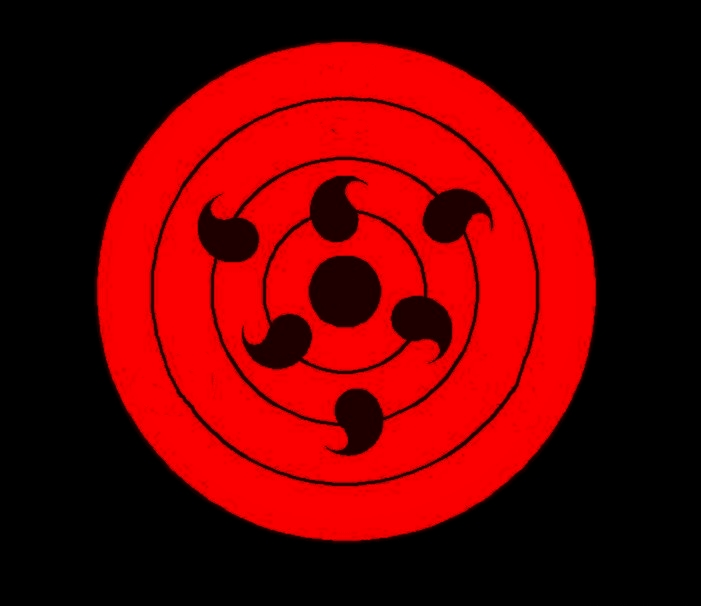

# 2022-3B 廖俊傑
## 2022-3B 廖俊傑
### 2022-3B 廖俊傑
#### 2022-3B 廖俊傑
#### 2022-3B 廖俊傑
##### 2022-3B 廖俊傑

This is a block needed to be noticed `small`. 
```
big
big
```

🐱 💋 😴
***
**幹嗎**
*哀*
~~歪~~

> 台北市
>>北投區

>>中山區

* Red
* Green
1. Bird
2. Dog
3. Cat



[](https://www.youtube.com/watch?v=StTqXEQ2l-Y "Everything Is AWESOME")
[](https://www.youtube.com/watch?v=sSm2dRarhPo "Everything Is AWESOME")

- [ ] todo list
- [x] done

```js
$scope.cookieGet = function(key)[
$scope.cookieResult = $cookiestore.get(key);
console. log ($scope.cookieResult);
```

|Left-Aligned   | Center Aligned  | Right Aligned |
|:--------------|:---------------:|--------------:|
| col 3 is      | some wordy text | $1600
| col 2 is      | centered        | $12
| zebra stripes | are neat        | $1 
| test |測試         | $3333  |


```javascript
function myfunction(pl, p2){
return p1 * p2; // The function returns the product of pi and p2
}
```

python code
```python
s = "Python syntax highlighting"
print s
```
- [ ] todo list
- [ ] 2nd things

|Markdown   | Less  | Pretty |
|:--------------|:---------------:|--------------:|
| Still      | `render` | nicely
| 1          | 2        | 3 
